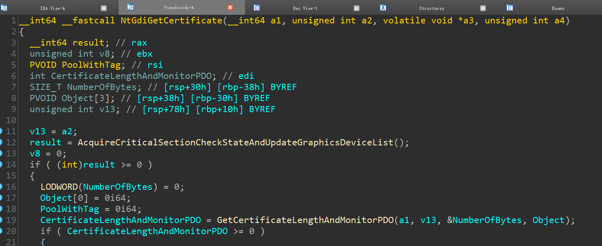
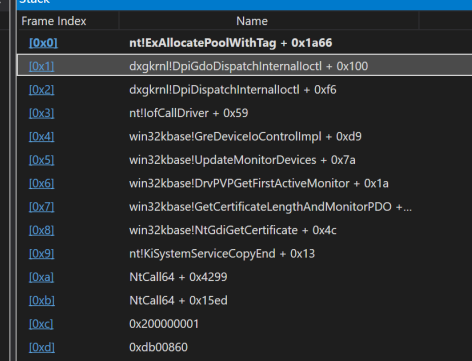
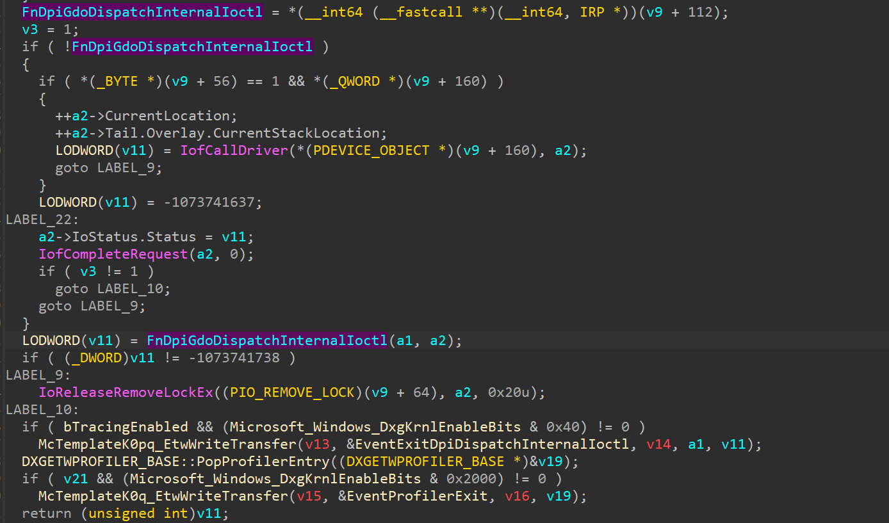
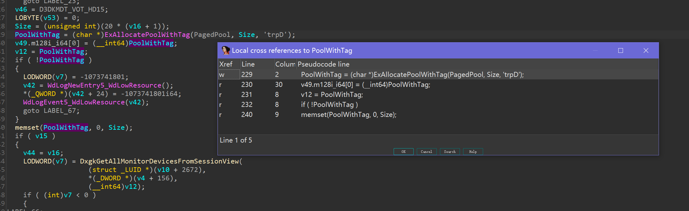
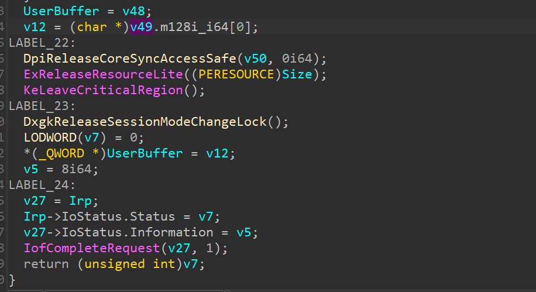
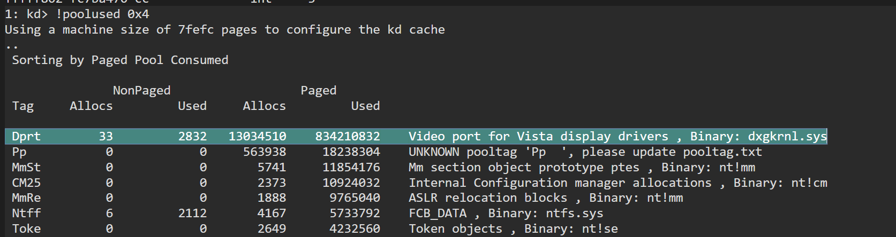
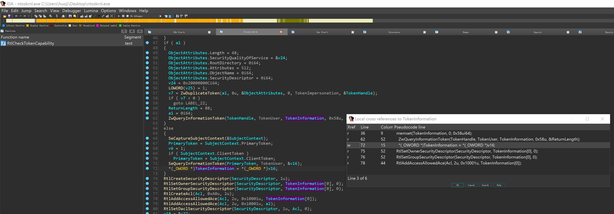
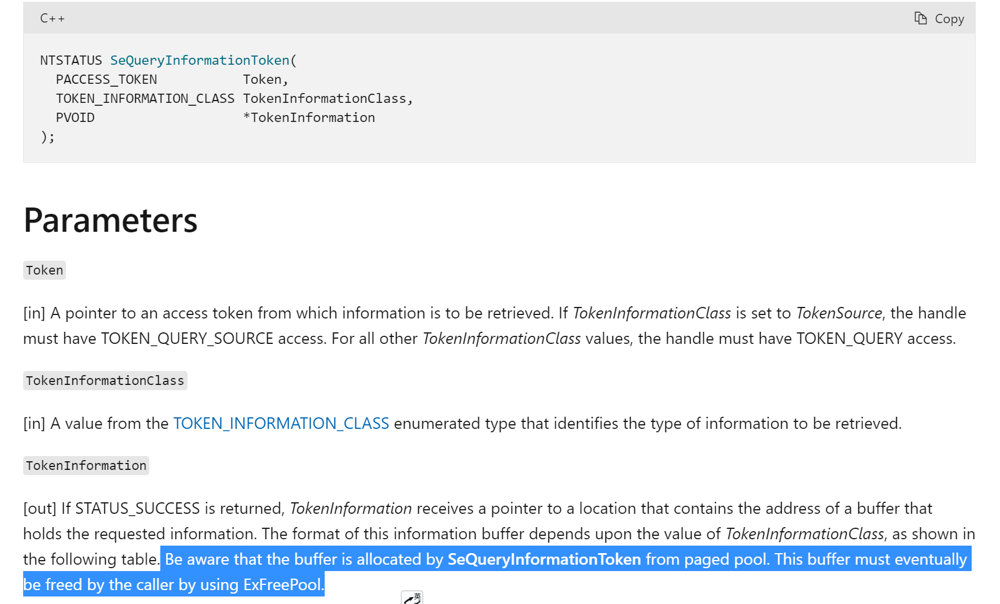
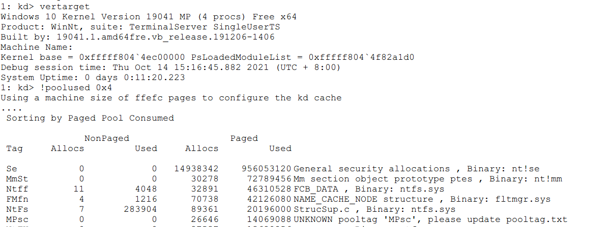
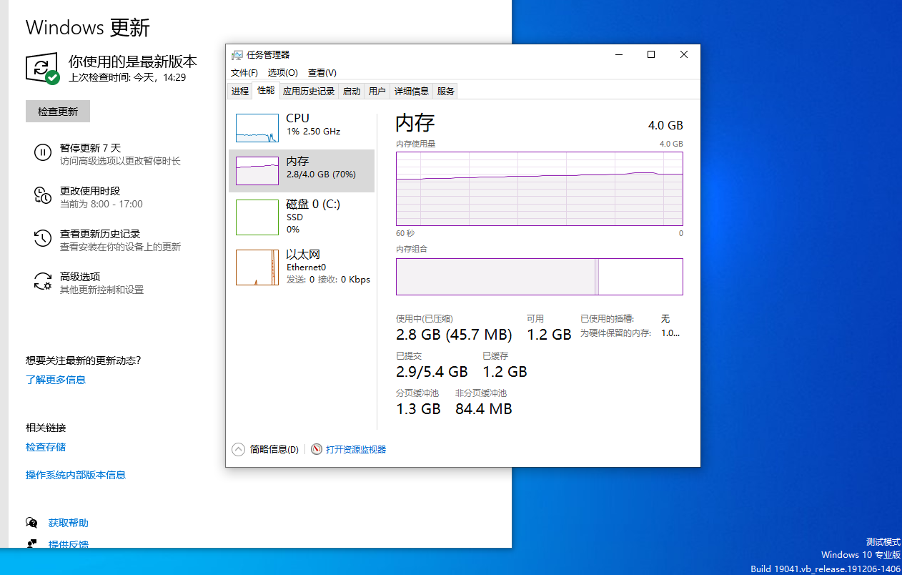

### Microsoft Kernel Memory Leak

***Please note that this is only a brief code bug. It is not a security problem and will not cause any security problems***

There are memory leaks in two Microsoft APIs:

```
win32kbase!NtDCompositionCommitSynchronizationObject
win32kbase!NtGdiGetCertificate
```

### win32kbase!NtGdiGetCertificate

The ``` win32kbase!NtGdiGetCertificate``` memory leak was patch in windows 20h1,but still work in windows 1803

The NtGdiGetCertificate will be call a function name "GetCertificateLengthAndMonitorPDO"



in "GetCertificateLengthAndMonitorPDO" will final going ”dxgkrnl.DpiDispatchInternalloctl“ by "iofcalldriver",the full call stack:



#### dxgkrnl!DpiDispatchInternalIoctl



##### dxgkrnl!FnDpiGdoDispatchInternalIoctl

its will allocate a pool memory name "trpD" (in windbg its call "Dprt"),but this pool memory ***will be never free***



the "v49" var:



###### poc

```
#include <iostream>
#include <Windows.h>
typedef void(__stdcall* fnNtGdiGetCertificate) (unsigned __int64 a1, unsigned __int64 a2, unsigned __int64* a3, unsigned __int64 a4);

int main()
{
    printf("NtGdiGetCertificate Memory Leak Tester 2021-10-14 by huoji \n");
	printf("press any btn to test\n");
	system("pause");
	PVOID win32u = LoadLibrary(TEXT("win32u.dll"));
	if (win32u == NULL) {
		printf("load win32u.dll error\n");
		system("pause");
		return 0;
	}
	fnNtGdiGetCertificate NtGdiGetCertificate = (fnNtGdiGetCertificate)GetProcAddress((HMODULE)win32u, "NtGdiGetCertificate");
	
	if (NtGdiGetCertificate) {
		printf("tesing NtGdiGetCertificate...\n");
		for (size_t i = 0; i < 65536; i++)
		{
			NtGdiGetCertificate(0xFFFF080000000000, 0xFFFFF80000000000, (unsigned __int64*)0x000000000000FFFE, 0xFFFF800000000000);

		}
	}
	printf("finished \n");
	system("pause");
	return 0;
}
```

###### result



### win32kbase!NtDCompositionCommitSynchronizationObject

This Leak Point was non patch in windows 21h1

the full callstack:

```
3: kd> k
 # Child-SP          RetAddr           Call Site
00 ffffef85`756fed10 fffff802`441b51c4 nt!ExAllocateHeapPool+0x1b1381
01 ffffef85`756fee50 fffff802`43e9502c nt!ExAllocatePoolWithTag+0x64
02 ffffef85`756feea0 fffff802`43d83204 nt!SeQueryInformationToken+0xdc
03 ffffef85`756fefd0 fffff802`44112a29 nt!RtlCheckTokenCapability+0x194
04 ffffef85`756ff2e0 ffffaa93`883d46f9 nt!RtlCapabilityCheck+0x329
05 ffffef85`756ff450 ffffaa93`8877ea62 win32kbase!NtDCompositionCommitSynchronizationObject+0x59
06 ffffef85`756ff490 fffff802`43c0a8b5 win32k!NtDCompositionCommitSynchronizationObject+0x16
07 ffffef85`756ff4c0 00007ff7`f8f94299 nt!KiSystemServiceCopyEnd+0x25
08 000000de`7e1ff288 00007ff7`f8f915ed NtCall64+0x4299
09 000000de`7e1ff290 00007ff7`f8f919ab NtCall64+0x15ed
0a 000000de`7e1ffbe0 00007ffd`f2767034 NtCall64+0x19ab
0b 000000de`7e1ffc10 00007ffd`f3022651 KERNEL32!BaseThreadInitThunk+0x14
0c 000000de`7e1ffc40 00000000`00000000 ntdll!RtlUserThreadStart+0x21
```

#### RtlCheckTokenCapability




in MSDN about "SeQueryInformationToken" 



well , it doesn't seem to have been released

### poc

pool memory in windbg:



No more code because of time,but you can reappearance it by NtCallFuzz tool in Credit

test time: 2021/10/14



### Credit

@[hfiref0x](https://github.com/hfiref0x) and [Windows NtCall Fuzz Tools][https://github.com/hfiref0x/NtCall64]

@[huoji][https://github.com/huoji120]

@[heromantf][https://github.com/heromantf]
